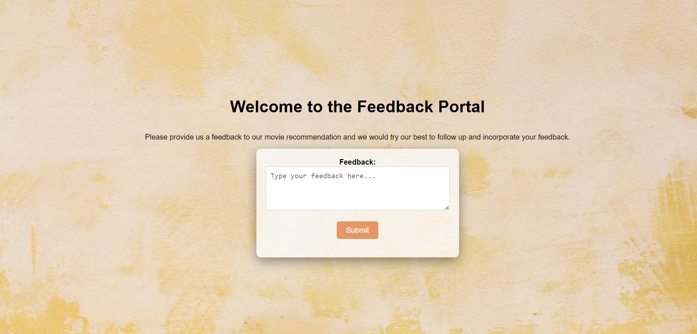
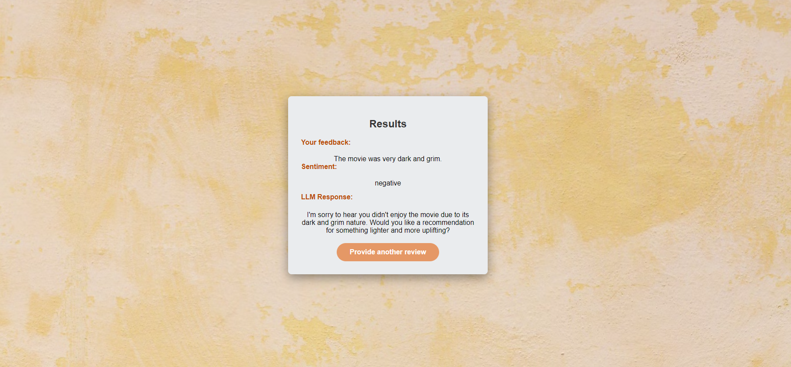

# Web Application for doing Sentiment Analysis of user feedback and generate a relevant response.

### Setup and configure
Execute following command to get the environment running:
```bash
.\basf\Scripts\activate
```
Enter following command to install the required dependencies:
```bash
pip install -r requirements.txt
```

### Azure Congitive Services integration
Create a Language resource and record the API key and endpoint to be used in app.py <br>
Add the key and endpoint to the .env file as follows:

```python
KEY=ENTER_YOUR_KEY
ENDPOINT=ENTER_YOUR_ENDPOINT
LOCATION=ENTER_YOUR_LOCATION
```

### Creating a secret key for OpenAI API and adding that in app.py
```python
openai.api_key = 'YOUR_API_KEY'
```
### Run the flask app with following command:
```bash
python -m flask --app .\app.py run
```
### Terminal will show following output:
```bash
 * Serving Flask app '.\app.py'
 * Debug mode: off
 * Running on http://127.0.0.1:5000
Press CTRL+C to quit
```
### Usage:
Open the url in browser and it will show the following landing page:


Sample response:

